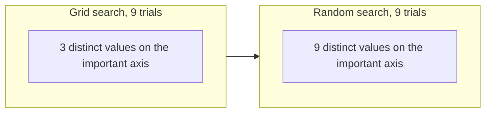

# Random Search for Hyperparameters

## 1. Introduction

Every learning algorithm carries a set of knobs that are not fit from data. Learning rates, regularization strengths, tree depths, kernel bandwidths, layer widths, and dropout fractions are all chosen by the practitioner before optimization begins. These knobs are the hyperparameters, and the quality of a model often depends more on setting them well than on the choice of algorithm itself. The task of selecting them is a black box optimization problem. We can evaluate a configuration by training a model and measuring validation performance, but we have no gradient, no closed form, and each evaluation is expensive.

To make the problem precise, let $\lambda = (\lambda_1, \dots, \lambda_d)$ denote a hyperparameter vector drawn from a configuration space $\Lambda = \Lambda_1 \times \cdots \times \Lambda_d$. Each coordinate space $\Lambda_j$ may be a real interval (a learning rate), a bounded integer set (a number of trees), or an unordered finite set (an optimizer choice). Training a model under $\lambda$ on a fixed training set and scoring it on held out data defines a response surface

$$
\Psi(\lambda) = \mathbb{E}_{(x, y) \sim \mathcal{D}}\,[\,\mathcal{L}(\hat{f}_\lambda(x), y)\,],
$$

where $\hat{f}_\lambda$ is the model trained under $\lambda$, $\mathcal{L}$ is a loss, and $\mathcal{D}$ is the data distribution. We never observe $\Psi$ directly. We observe a noisy estimate of it on a finite validation set, and the goal of hyperparameter tuning is to find $\lambda^\star = \arg\min_{\lambda \in \Lambda} \Psi(\lambda)$ using as few evaluations as the budget allows.

Grid search has long been the default protocol. The practitioner discretizes each hyperparameter into a small set of values and evaluates the full Cartesian product. It is simple, embarrassingly parallel, and reproducible. Yet for problems with more than a few hyperparameters, grid search wastes most of its budget. The central insight of this chapter, due to Bergstra and Bengio [1], is that random search over the same space is not merely competitive with grid search but is provably and empirically superior in the regimes that matter for modern machine learning. We develop why this is true, how to choose sampling distributions, and how to allocate a fixed budget of evaluations.

## 2. The Geometry of Grid Search

### 2.1 The Cartesian Trap

Suppose we tune $d$ hyperparameters and place $k$ grid points along each axis. The grid contains $k^d$ configurations. This exponential growth is the curse of dimensionality in its plainest form. With $k = 5$ and $d = 6$ we already face $15{,}625$ evaluations. If each evaluation takes an hour, the full grid takes nearly two years of serial compute. To stay within budget the practitioner is forced to shrink $k$, which coarsens the resolution along every axis simultaneously.

### 2.2 Low Effective Dimensionality

The deeper problem is not cost but coverage. Empirically, validation performance for most models depends strongly on only a few hyperparameters and weakly on the rest. Bergstra and Bengio call this property low effective dimensionality [1].

::: {.callout-note title="Definition: effective dimensionality"}
A response surface $\Psi$ has effective dimensionality $d_{\text{eff}}$ if there exists a coordinate subset $S \subseteq \{1, \dots, d\}$ with $|S| = d_{\text{eff}}$ such that $\Psi(\lambda)$ depends almost entirely on the coordinates $\lambda_S$ and only negligibly on the remaining $d - d_{\text{eff}}$ coordinates. Equivalently, the variance of $\Psi$ explained by perturbing the coordinates outside $S$ is small relative to the variance explained by $\lambda_S$.
:::

When $d_{\text{eff}}$ is much smaller than $d$, the function we are optimizing varies almost entirely along a low dimensional subspace of the configuration space, and the irrelevant coordinates contribute little more than noise.

Now consider how grid search samples an important axis. With a $k \times k$ grid over two parameters where only the first matters, the grid tests just $k$ distinct values of the important parameter, even though it spends $k^2$ evaluations. The other $k^2 - k$ evaluations are duplicates along the axis that controls performance. Random search, by contrast, almost surely tests $n$ distinct values of every parameter when it draws $n$ configurations from any continuous distribution. This difference in marginal coverage is the heart of the argument.

The contrast is easiest to see as a picture. In the grid layout the projections onto the important axis pile up on a few vertical lines. In the random layout every draw projects to a fresh value of the important parameter.



## 3. Why Random Search Wins

### 3.1 The Marginal Coverage Argument

Project the search onto the single most important hyperparameter. Grid search with $n = k^d$ total points yields only $k = n^{1/d}$ distinct values along that axis. Random search yields $n$ distinct values, one per draw. As $d$ grows, $n^{1/d}$ collapses toward one while $n$ stays fixed, so random search interrogates the dimension that controls the loss far more finely for the same total cost. The wasted evaluations of grid search are wasted precisely because they vary only the irrelevant coordinates.

A concrete instance fixes the intuition. Take $d = 10$ and a budget of $n = 1024$ trials. Grid search can afford only $k = n^{1/d} = 1024^{1/10} = 2$ points per axis, so it probes each hyperparameter at exactly two values. Random search probes the most important hyperparameter at $1024$ distinct values. The same budget buys a resolution that is more than two orders of magnitude finer along the axis that matters.

### 3.2 A Probabilistic Guarantee

Random search also admits a clean budget guarantee that requires no assumptions about smoothness. Define the target region as the top $\alpha$ fraction of the configuration space ranked by performance, so a uniformly drawn configuration lands in it with probability $\alpha$. Let $X_i$ be the indicator that draw $i$ lands in the target region. The draws are independent, so the probability that none of the $n$ draws hits the target is $(1 - \alpha)^n$, and the probability that at least one lands in it is

$$
P(\text{hit}) = 1 - (1 - \alpha)^{n}.
$$

To reach confidence $1 - \delta$ of hitting the top $\alpha$ region we require $1 - (1 - \alpha)^n \ge 1 - \delta$, that is $(1 - \alpha)^n \le \delta$. Taking logarithms and dividing by $\log(1 - \alpha)$, which is negative so the inequality flips, gives

$$
n \ge \frac{\log \delta}{\log(1 - \alpha)}.
$$

For the top $5\%$ region with $\delta = 0.05$ this gives $n \ge \log(0.05) / \log(0.95) \approx 58.4$, so $n = 59$ draws suffice. Strikingly, this bound is independent of $d$. Whether we tune three hyperparameters or thirty, about sixty random draws place us in the best $5\%$ with $95\%$ confidence. The table below reads off the trial count for a few common targets.

| Target fraction $\alpha$ | Confidence $1 - \delta$ | Required trials $n$ |
|:--|:--|:--|
| 0.10 | 0.90 | 22 |
| 0.05 | 0.95 | 59 |
| 0.05 | 0.99 | 90 |
| 0.01 | 0.95 | 299 |

Two caveats keep the guarantee honest. First, the target is defined relative to the chosen search space and sampling distribution. Landing in the best $5\%$ of a badly specified space is not the same as landing near the global optimum, so the bound rewards a well chosen distribution. Second, the bound concerns the underlying response surface $\Psi$, while in practice we rank configurations by a noisy validation estimate. Holding out enough validation data, or averaging over folds, keeps the ranking faithful. Grid search has no comparable guarantee because its coverage of any single axis degrades as $d$ increases.

### 3.3 Empirical Confirmation

Bergstra and Bengio demonstrated on neural network and deep belief network benchmarks that random search with a modest budget matched or exceeded grid search that used many times more evaluations, and that it did so while exploring more of the space along the influential axes [1]. The practical lesson is blunt. For more than two or three hyperparameters, prefer random search.

## 4. Sampling Distributions

A random search is only as good as the distribution it samples from. Choosing distributions thoughtfully is where domain knowledge enters.

### 4.1 Match the Scale of the Parameter

Parameters that act multiplicatively should be sampled on a logarithmic scale. A learning rate of $0.001$ and one of $0.01$ differ by an order of magnitude, and the interesting range often spans several decades. Sampling uniformly in $[10^{-5}, 10^{-1}]$ would place ninety percent of draws above $10^{-2}$ and starve the small values. Instead sample the exponent uniformly,

$$
u \sim \mathrm{Uniform}(-5, -1), \qquad \eta = 10^{u}.
$$

The resulting variable $\eta$ follows the log uniform or reciprocal distribution, whose density on $[a, b]$ is

$$
p(\eta) = \frac{1}{\eta \,\ln(b / a)}, \qquad a \le \eta \le b.
$$

The defining property is scale invariance over the decades. Each interval $[10^{m}, 10^{m+1}]$ receives equal probability mass, so every order of magnitude is explored equally. This is the right default for learning rates, regularization coefficients, and any positive scale parameter.

```python
import numpy as np

def sample_config(rng):
    return {
        "learning_rate": 10 ** rng.uniform(-5, -1),   # log-uniform
        "weight_decay": 10 ** rng.uniform(-6, -2),    # log-uniform
        "dropout": rng.uniform(0.0, 0.6),             # linear
        "hidden_units": int(2 ** rng.integers(6, 11)),# 64..1024
        "optimizer": rng.choice(["adam", "sgd"]),     # categorical
    }
```

### 4.2 A Taxonomy of Choices

Use a linear uniform distribution for parameters bounded on both sides with no multiplicative character, such as a dropout fraction in $[0, 0.6]$. Use a discrete uniform over integers for counts such as layers or trees. Use a categorical distribution for unordered choices such as the optimizer or activation function. When prior runs suggest a good neighborhood, a Gaussian or log normal centered there focuses the search while still exploring.

The table summarizes the standard correspondence between parameter character and sampling distribution.

| Parameter character | Example | Distribution |
|:--|:--|:--|
| Positive, multiplicative | learning rate, weight decay | log uniform |
| Bounded, additive | dropout, momentum | linear uniform |
| Integer count | layers, trees, neighbors | discrete uniform |
| Unordered choice | optimizer, activation | categorical |
| Known good neighborhood | refinement round | Gaussian or log normal |

### 4.3 Quantization and Conditional Spaces

Some parameters take only specific values, for example a batch size that must be a power of two. Sample the exponent as an integer and exponentiate. Other parameters exist only when a parent is set a certain way. The number of units in a third layer is meaningful only if the network has at least three layers. Such conditional or tree structured spaces are sampled hierarchically by first drawing the parent, then drawing children only when they apply. Naively gridding a conditional space wastes enormous budget on configurations whose extra parameters are inert, because the grid enumerates child values that the model never reads.

## 5. Budget Allocation

A fixed compute budget can be spent in many ways, and how it is spent matters as much as the sampling distribution.

### 5.1 Setting the Number of Trials

The guarantee of Section 3.2 turns a confidence target into a trial count. If you want the top $\alpha$ fraction with confidence $1 - \delta$, draw $n = \lceil \log \delta / \log(1 - \alpha) \rceil$ configurations. This number does not grow with the dimension of the search space, so adding a hyperparameter you are unsure about costs nothing in trial count. It only widens the region random search can reach.

### 5.2 Parallelism and Reproducibility

Random search is embarrassingly parallel. Because draws are independent, $n$ trials run across $w$ workers in $\lceil n / w \rceil$ wall clock rounds with no coordination. Seed the generator so the sequence of configurations is reproducible, and log every configuration with its score so the run can be audited and extended. A run that doubles its budget simply draws more samples from the same distribution and appends them, a property grid search lacks because refining a grid changes every point.

### 5.3 Early Stopping and Successive Halving

Pure random search spends the same effort on every configuration, including obviously poor ones. Multi fidelity methods fix this by treating training length, dataset size, or epoch count as a cheap proxy for final performance. Successive halving allocates a small budget to many random configurations, keeps the top fraction, multiplies their budget, and repeats [2]. With an elimination factor $\eta$ (commonly $\eta = 3$), each rung keeps the best $1 / \eta$ of the survivors and multiplies their per configuration budget by $\eta$, so the product of population and budget per configuration stays roughly constant across rungs. Starting from $n$ configurations there are about $\lceil \log_\eta n \rceil$ rungs, and a surviving configuration at a rung with population $n_i$ receives on the order of

$$
b_i \;\approx\; \frac{B}{n_i \,\lceil \log_\eta n \rceil}
$$

resource, which grows as the population shrinks geometrically. Hyperband wraps successive halving in an outer loop that hedges across different initial population sizes, trading breadth against the risk of cutting a slow starter too early [2]. These methods keep random sampling as their proposal mechanism and add only a principled rule for where to stop.

### 5.4 When to Reach for Something Smarter

Random search is uninformed. It does not learn from the trials it has already run. When evaluations are very expensive and the budget is small, a model based approach can do better by fitting a surrogate to past results and proposing the next configuration where expected improvement is high. Sequential model based optimization, including the Tree structured Parzen Estimator and Gaussian process Bayesian optimization, formalizes this idea [3], and broader surveys catalog the design space of such methods [4]. Yet random search remains the right baseline and the right default. It is trivial to implement, parallelizes perfectly, has a dimension free guarantee, and is the protocol against which every adaptive method must justify its added complexity.

Mature open source tooling covers the whole spectrum. The `RandomizedSearchCV` estimator in scikit learn implements random search directly over scikit learn pipelines, while Optuna and Ray Tune provide random, Hyperband, and Bayesian samplers under a single interface, so moving from a random baseline to an adaptive method rarely requires rewriting the search loop.

## 6. Worked Example

Consider tuning a gradient boosted tree model with four hyperparameters: a learning rate, a maximum tree depth, a number of estimators, and a subsample fraction. Suppose validation accuracy depends strongly on the learning rate, moderately on the depth, and only weakly on the other two. The effective dimensionality is roughly two.

A grid search with five points per axis would spend $5^4 = 625$ evaluations yet test only five distinct learning rates and five distinct depths. A random search with $59$ evaluations, drawn from a log uniform learning rate, a log uniform regularization, a discrete uniform depth, and a linear uniform subsample fraction, tests $59$ distinct learning rates and is guaranteed by Section 3.2 to land in the best $5\%$ of the space with $95\%$ confidence. It does this with under a tenth of the grid budget.

After the run, plot validation score against each hyperparameter, one panel per axis. The learning rate panel will show a clear trough at the good value, the depth panel a weaker trend, and the subsample and estimator panels little structure at all. This marginal scatter is itself a diagnostic. It reveals the effective dimensionality empirically and tells you which ranges to narrow in a refinement round and which axes to leave alone.

## 7. Practical Protocol

A reliable workflow combines the pieces above.

1. Define each hyperparameter with an explicit distribution that respects its scale and type, using log uniform for multiplicative quantities.
2. Choose the number of trials from the confidence bound of Section 3.2 rather than from habit.
3. Run the trials in parallel under a fixed seed, logging every configuration and score.
4. Inspect the marginal scatter of score against each hyperparameter to learn which axes actually matter.
5. Optionally narrow the ranges around the best region and run a second round.
6. If evaluations are costly, layer successive halving or Hyperband on top so the budget concentrates on promising configurations.

This protocol is cheap to build, easy to reason about, and hard to beat without considerably more machinery.

### When to use and pitfalls

Random search is the right default whenever there are more than two or three hyperparameters, when evaluations parallelize, and when you want a strong baseline before investing in adaptive methods. Reach for Bayesian optimization instead only when each evaluation is so costly that the budget is a handful of trials and the small adaptive overhead pays for itself.

The common failure modes are about the search space rather than the algorithm. Sampling a multiplicative parameter on a linear scale starves the small values and is the single most frequent mistake. Setting the bounds too narrow guarantees you never reach the optimum, while setting them so wide that almost all mass is wasted defeats the dimension free guarantee, since the top $\alpha$ region is then defined over a mostly hopeless space. Ranking configurations on a validation set that is too small lets noise dominate the comparison. And forgetting to seed the generator forfeits reproducibility, which is one of the method's chief advantages.

## 8. Summary

Grid search fails in high dimensions because its budget grows as $k^d$ while its coverage of any single influential axis grows only as $n^{1/d}$. Random search inverts this. It tests a distinct value of every parameter on every draw, it carries a dimension free probabilistic guarantee of landing in the best region, and it parallelizes without coordination. Its effectiveness rests on choosing sampling distributions that match the scale and type of each parameter, especially the log uniform distribution for multiplicative quantities. With a sensible trial count and optional multi fidelity early stopping, random search is the practical default for hyperparameter tuning and the baseline every more sophisticated method should be measured against.

## References

1. Bergstra, J., and Bengio, Y. (2012). Random Search for Hyper-Parameter Optimization. Journal of Machine Learning Research, 13, 281 to 305. https://www.jmlr.org/papers/v13/bergstra12a.html
2. Li, L., Jamieson, K., DeSalvo, G., Rostamizadeh, A., and Talwalkar, A. (2018). Hyperband: A Novel Bandit-Based Approach to Hyperparameter Optimization. Journal of Machine Learning Research, 18(185), 1 to 52. https://www.jmlr.org/papers/v18/16-558.html
3. Bergstra, J., Bardenet, R., Bengio, Y., and Kegl, B. (2011). Algorithms for Hyper-Parameter Optimization. Advances in Neural Information Processing Systems 24. https://papers.nips.cc/paper/2011/hash/86e8f7ab32cfd12577bc2619bc635690-Abstract.html
4. Feurer, M., and Hutter, F. (2019). Hyperparameter Optimization. In Automated Machine Learning, Springer, 3 to 33. https://doi.org/10.1007/978-3-030-05318-5_1
