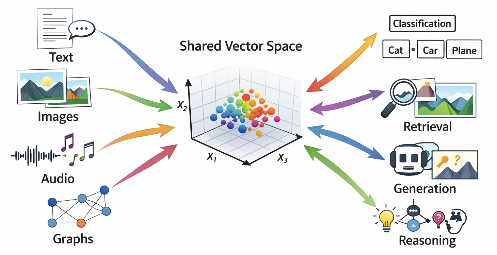

# Representations and embeddings



Almost every modern AI system is built on the same idea:

> Turn complex objects into vectors that live in a relatively low-dimensional space, then operate on those vectors.

Words, images, audio clips, graphs, user profiles, molecules, and entire documents all end up as points in some high-dimensional vector space. Learning useful **representations** is at least half of the story of deep learning [@bengio2013representation].

This chapter develops a systematic view of representations and embeddings, with three goals:

1.  Explain **what** representations are and **why** vector spaces are so central.
2.  Show **how** to construct linear and nonlinear feature maps in practice, at both small and production scales.
3.  Develop geometric and information-theoretic intuitions that we will reuse when we talk about attention, contrastive learning, and generative models.

We will move through:

-   Linear and nonlinear feature maps.
-   Distributional and embedding-based representations of words and tokens.
-   Manifold hypotheses about high-dimensional data.
-   Information bottleneck ideas and compression.
-   Geometric properties of learned representations.

------------------------------------------------------------------------

## What is a representation?

At a high level, a **representation** is a mapping from objects of interest into a space where learning and reasoning are convenient.

Formally, let $\mathcal{X}$ be a set of inputs: sentences, images, graphs, etc. A representation is a function

$$
\phi: \mathcal{X} \to \mathbb{R}^d
$$

that maps each input $x \in \mathcal{X}$ to a vector $\phi(x)$ in a $d$-dimensional space. This $\phi$ might be:

-   Handcrafted, as in classical feature engineering.
-   Learned, as in neural networks.

The downstream model then operates on $\phi(x)$ instead of directly on $x$:

$$
f_\theta(x) = g_\theta(\phi(x)).
$$

In deep learning, $\phi$ is itself parameterized and learned:

$$
\phi_\psi: \mathcal{X} \to \mathbb{R}^d, \quad f_{\theta,\psi}(x) = g_\theta(\phi_\psi(x)).
$$

The key advantages of vector representations:

-   We can use linear algebra (dot products, matrix multiplication, eigenvalue decompositions).
-   We can measure similarity with norms and angles.
-   Computations can be batched and run on accelerators.

The subtlety, and much of the art, lies in how we choose or learn $\phi$.

------------------------------------------------------------------------

## Linear feature maps

We start with linear feature maps, both fixed and learned. They are limited but foundational.

### One hot and bag of words

For a finite vocabulary $\mathcal{V}$ (words, tokens, discrete IDs), the simplest representation is **one-hot encoding**:

-   Fix an ordering of tokens in the vocabulary, so $\mathcal{V} = {w_1, \dots, w_{|\mathcal{V}|}}$.
-   Represent token $w_j$ as a vector $e_j \in \mathbb{R}^{|\mathcal{V}|}$ with a 1 in position $j$ and 0 elsewhere.

This is a linear feature map:

$$
\phi_{\text{one-hot}}: \mathcal{V} \to \mathbb{R}^{|\mathcal{V}|}.
$$

For documents, we can use **bag of words** representations:

-   Count how many times each vocabulary word appears in the document.
-   Optionally normalize or weight using tf-idf.

These are high dimensional and sparse, but conceptually simple.

```{python}
from collections import Counter
from typing import List, Dict, Tuple

import numpy as np
import scipy.sparse as sp


def build_vocabulary(corpus: List[List[str]], min_freq: int = 1) -> Dict[str, int]:
    """
    Build token to index mapping from a tokenized corpus.
    corpus: list of documents, each a list of tokens.
    """
    freq = Counter()
    for doc in corpus:
        freq.update(doc)

    vocab = {}
    for token, count in freq.items():
        if count >= min_freq:
            vocab[token] = len(vocab)
    return vocab


def one_hot_encode(token: str, vocab: Dict[str, int]) -> np.ndarray:
    """Dense one hot vector for a single token."""
    d = len(vocab)
    vec = np.zeros(d, dtype=float)
    if token in vocab:
        vec[vocab[token]] = 1.0
    return vec


def bow_sparse_matrix(
    corpus: List[List[str]],
    vocab: Dict[str, int],
) -> sp.csr_matrix:
    """
    Build a sparse bag-of-words matrix X of shape (n_docs, |vocab|).
    Entry X[i, j] is the count of vocab token j in document i.
    """
    rows = []
    cols = []
    data = []

    for i, doc in enumerate(corpus):
        counts = Counter(token for token in doc if token in vocab)
        for token, c in counts.items():
            rows.append(i)
            cols.append(vocab[token])
            data.append(c)

    n_docs = len(corpus)
    X = sp.csr_matrix((data, (rows, cols)), shape=(n_docs, len(vocab)), dtype=float)
    return X


def tfidf_transform(X: sp.csr_matrix) -> sp.csr_matrix:
    """
    Apply a simple tf-idf transform to a sparse count matrix X.
    tf = count in document / total counts in document.
    idf = log((1 + n_docs) / (1 + df)) + 1, where df is document frequency.
    """
    n_docs, n_terms = X.shape
    # Document frequency for each term.
    df = (X > 0).sum(axis=0).A1  # shape: (n_terms,)
    idf = np.log((1 + n_docs) / (1 + df)) + 1.0

    # Term frequencies: normalize rows to sum to 1
    row_sums = np.asarray(X.sum(axis=1)).ravel()
    row_sums[row_sums == 0] = 1.0
    inv_row_sums = 1.0 / row_sums
    D_inv = sp.diags(inv_row_sums)
    tf = D_inv @ X

    # Apply idf.
    IDF = sp.diags(idf)
    tfidf = tf @ IDF
    return tfidf
```

Notes:

-   We use `scipy.sparse` to handle large vocabularies and corpora. In production, bag-of-words matrices can be extremely sparse and must be stored and processed as such.
-   `tfidf_transform` illustrates a common weighting scheme that downweights very frequent words.

Even though one-hot and bag-of-words representations are simple, they already enable powerful linear models (SVMs, logistic regression) for text classification and retrieval tasks.

### Learned linear projections

One-hot vectors are extremely high-dimensional. A standard remedy is to learn a linear projection to a lower-dimensional space.

Let $x \in \mathbb{R}^{D}$ be a feature vector (for example, bag of words). A linear embedding is

$$
z = W x, \quad W \in \mathbb{R}^{d \times D},
$$

where typically $d \ll D$. In neural networks, such linear layers are ubiquitous.

```{python}
class LinearProjection:
    """
    Simple linear feature map z = W x + b.

    For high dimensional sparse x, we assume x is a scipy sparse CSR row vector.
    """

    def __init__(self, in_dim: int, out_dim: int, rng: np.random.Generator | None = None):
        self.in_dim = in_dim
        self.out_dim = out_dim
        if rng is None:
            rng = np.random.default_rng(0)
        # Xavier initialization
        limit = np.sqrt(6.0 / (in_dim + out_dim))
        self.W = rng.uniform(-limit, limit, size=(out_dim, in_dim)).astype(np.float32)
        self.b = np.zeros(out_dim, dtype=np.float32)

    def __call__(self, x) -> np.ndarray:
        """
        Apply linear map. x can be dense (1D array) or sparse row vector.
        Returns dense vector z of shape (out_dim,).
        """
        if sp.issparse(x):
            z = self.W @ x.T  # shape (out_dim, 1)
            z = np.asarray(z).reshape(-1).astype(np.float32)
        else:
            x = np.asarray(x, dtype=np.float32)
            z = self.W @ x
        return z + self.b
```

For very large dimensions, we rarely store full $W$ explicitly unless $in_{dim}$ is already modest. For very large categorical spaces we use embedding tables, which is the next topic.

------------------------------------------------------------------------

## Embedding tables for high cardinality categorical features

In large production systems, we often have categorical IDs:

-   User IDs, item IDs, product IDs.
-   Token IDs in very large vocabularies.
-   Categorical combinations of features.

A standard pattern is to maintain an embedding table:

$$
E \in \mathbb{R}^{|\mathcal{C}| \times d},
$$

where each category $c \in \mathcal{C}$ has a learned vector $E_c \in \mathbb{R}^d$.

Lookup is simply:

$$
\phi(c) = E_c.
$$

The gradient during training only updates the rows of $E$ that were actually used in the batch. This sparsity is crucial at large-scale.

------------------------------------------------------------------------

### The General Framework

An embedding is: **discrete object → continuous vector such that vector similarity reflects meaningful object similarity**

**What are you embedding?**

| Unit Level | Text Domain | Graph Domain | Image Domain | Recommendation Domain |
|---------------|---------------|---------------|---------------|---------------|
| Atomic element | Token (Word2Vec, GloVe) | Node (DeepWalk, Node2Vec, GraphSAGE) | Pixel/Patch (ViT patches) | User or Item (matrix factorization) |
| Pairwise relation | Word pair / collocation | Edge (TransE, DistMult, RotatE) | Spatial relationship | User-item interaction |
| Multi-way relation | n-gram, phrase | Hyperedge (HyperGCN, HGNN) | Scene graph relations | Session or basket |
| Local structure | Sentence (Sentence-BERT) | Subgraph / Motif (Subgraph2Vec) | Object / Region (RoI features) | User neighborhood |
| Community / cluster | Paragraph, topic | Community (ComE, vGraph) | Image segment | User segment |
| Whole structure | Document (Doc2Vec) | Graph (Graph2Vec, DiffPool) | Full image (ResNet, CLIP) | Full catalog / platform |

: The Two Universal Questions

1.  **What's the unit?**

Determined by your downstream task

-   Classifying documents → document embedding.

-   Predicting links → edge or node-pair embedding.

-   Comparing networks → graph embedding.

2.  **What training signal defines similarity?**

| Signal Type | How It Works | Examples |
|-------------------------|---------------------------|--------------------|
| Co-occurrence | Things in similar contexts are similar | Word2Vec, DeepWalk, GloVe |
| Supervision | Things with same labels are similar | Fine-tuned BERT, supervised GNN |
| Contrastive | Push positives together, negatives apart | SimCLR, GraphCL, CLIP |
| Reconstruction | Good embeddings can rebuild the input | Autoencoders, GAE |
| Translation/transformation | Relations as operations on embeddings | TransE, RotatE |

Everything else is implementation detail.

### Numpy implementation of an embedding table

```{python}
from dataclasses import dataclass
from typing import Sequence


@dataclass
class EmbeddingTable:
    """
    Simple embedding table for categorical IDs 0, 1, ..., num_embeddings - 1.
    """
    num_embeddings: int
    embedding_dim: int
    weights: np.ndarray  # shape (num_embeddings, embedding_dim)

    @classmethod
    def random(
        cls,
        num_embeddings: int,
        embedding_dim: int,
        rng: np.random.Generator | None = None,
    ) -> "EmbeddingTable":
        if rng is None:
            rng = np.random.default_rng(0)
        limit = np.sqrt(6.0 / (num_embeddings + embedding_dim))
        weights = rng.uniform(-limit, limit, size=(num_embeddings, embedding_dim)).astype(np.float32)
        return cls(num_embeddings=num_embeddings, embedding_dim=embedding_dim, weights=weights)

    def lookup(self, ids: Sequence[int]) -> np.ndarray:
        """
        Return embedding matrix of shape (len(ids), embedding_dim).
        """
        ids = np.asarray(ids, dtype=int)
        return self.weights[ids]

    def update(self, ids: Sequence[int], grad_embeddings: np.ndarray, lr: float) -> None:
        """
        Gradient descent update for a batch of embeddings.
        ids: indices used in this batch, shape (batch_size,)
        grad_embeddings: gradient wrt embeddings, shape (batch_size, embedding_dim)
        Only those rows are updated.
        """
        ids = np.asarray(ids, dtype=int)
        assert grad_embeddings.shape == (len(ids), self.embedding_dim)
        # Accumulate gradient per row in case of duplicates
        grad_accum = np.zeros_like(self.weights)
        np.add.at(grad_accum, ids, grad_embeddings)
        self.weights -= lr * grad_accum
```

This pattern (store a big matrix, do row lookups, update only those rows) is the basis of token embeddings in language models, as well as user and item embeddings in recommender systems.

In production with billions of IDs:

-   The embedding table may be sharded across many machines.
-   Some rows may be evicted or stored on slower storage when rarely used.
-   Quantization and compression of embeddings become important for memory and bandwidth.

Conceptually, though, the core abstraction remains: an embedding table is a learned dictionary from IDs to vectors.

------------------------------------------------------------------------

## 4. Nonlinear feature maps

Linear maps can only capture linear structure. To represent more complex patterns, we use nonlinear feature maps.

Two complementary viewpoints:

1.  Explicit nonlinear transformations $\phi(x)$ applied before a linear model.
2.  Deep networks where layers and activations jointly form $\phi_\psi(x)$.

### 4.1 Kernel features and random Fourier features

Classical kernel methods rely on the idea of mapping inputs into a (possibly infinite dimensional) feature space where linear methods are powerful.

Given a positive definite kernel $k(x, x') = \langle \phi(x), \phi(x') \rangle$, one can work with $\phi$ implicitly via kernel evaluations. However, this does not scale well to large datasets.

**Random Fourier features** approximate shift invariant kernels such as the Gaussian kernel:

$$
k(x, x') = \exp\left( -\frac{|x - x'|_2^2}{2 \sigma^2} \right).
$$

The key result {cite}`rahimi2007random` is that we can approximate $k(x, x')$ with a randomly generated finite dimensional map $\phi(x) \in \mathbb{R}^D$ such that

$$
k(x, x') \approx \phi(x)^\top \phi(x').
$$

Construction:

-   Sample $D$ random frequencies $\omega_i \sim \mathcal{N}(0, \sigma^{-2} I_d)$.
-   Sample random phases $b_i \sim \text{Uniform}[0, 2\pi]$.
-   Define $$
    \phi(x) = \sqrt{\frac{2}{D}} \left[\cos(\omega_1^\top x + b_1), \dots, \cos(\omega_D^\top x + b_D)\right].
    $$

Then inner products in the feature space approximate the Gaussian kernel.

```{python}
class RandomFourierFeatures:
    """
    Random Fourier feature map approximating a Gaussian kernel.

    phi(x) = sqrt(2 / D) * cos(W x + b),
    where rows of W are drawn from N(0, sigma^{-2} I).
    """

    def __init__(self, input_dim: int, num_features: int, sigma: float, rng: np.random.Generator | None = None):
        self.input_dim = input_dim
        self.num_features = num_features
        self.sigma = sigma
        if rng is None:
            rng = np.random.default_rng(0)
        self.W = rng.normal(loc=0.0, scale=1.0 / sigma, size=(num_features, input_dim)).astype(np.float32)
        self.b = rng.uniform(0.0, 2.0 * np.pi, size=(num_features,)).astype(np.float32)

    def __call__(self, X: np.ndarray) -> np.ndarray:
        """
        Map a batch X of shape (n_samples, input_dim) to random Fourier features
        of shape (n_samples, num_features).
        """
        X = np.asarray(X, dtype=np.float32)
        # Compute W x + b for each sample.
        WX = X @ self.W.T  # shape (n_samples, num_features)
        return np.sqrt(2.0 / self.num_features) * np.cos(WX + self.b)
```

We can then train a linear model on top of `RandomFourierFeatures` to approximate a nonlinear kernel method while keeping training and inference linear in the dataset size and feature dimension.

### 4.2 Multilayer nonlinear feature maps (feedforward networks)

In deep learning, we implement nonlinear feature maps as compositions of linear layers and nonlinear activation functions:

$$
\phi(x) = \phi^{(L)} \circ \dots \circ \phi^{(1)}(x),
$$

where each layer has the form

$$
\phi^{(\ell)}(h) = \sigma(W^{(\ell)} h + b^{(\ell)}).
$$

Even a two layer network can represent highly nonlinear decision boundaries.

A minimalist fully connected network for tabular inputs using NumPy:

```{python}
class TwoLayerMLP:
    """
    Two layer perceptron: h = relu(W1 x + b1), z = W2 h + b2.
    """

    def __init__(self, input_dim: int, hidden_dim: int, output_dim: int, rng: np.random.Generator | None = None):
        if rng is None:
            rng = np.random.default_rng(0)
        self.input_dim = input_dim
        self.hidden_dim = hidden_dim
        self.output_dim = output_dim

        limit1 = np.sqrt(6.0 / (input_dim + hidden_dim))
        limit2 = np.sqrt(6.0 / (hidden_dim + output_dim))

        self.W1 = rng.uniform(-limit1, limit1, size=(hidden_dim, input_dim)).astype(np.float32)
        self.b1 = np.zeros(hidden_dim, dtype=np.float32)
        self.W2 = rng.uniform(-limit2, limit2, size=(output_dim, hidden_dim)).astype(np.float32)
        self.b2 = np.zeros(output_dim, dtype=np.float32)

    @staticmethod
    def relu(z: np.ndarray) -> np.ndarray:
        return np.maximum(z, 0.0)

    def forward(self, X: np.ndarray) -> np.ndarray:
        X = np.asarray(X, dtype=np.float32)
        h = self.relu(X @ self.W1.T + self.b1)
        z = h @ self.W2.T + self.b2
        return z

    def forward_hidden(self, X: np.ndarray) -> np.ndarray:
        """Return hidden representation h, which is a learned nonlinear feature."""
        X = np.asarray(X, dtype=np.float32)
        return self.relu(X @ self.W1.T + self.b1)
```

Training this MLP with SGD on a classification task will produce a hidden representation `h` that is tuned to separate the classes in a way that a simple linear classifier in `h` space can use.

In practice, we rely on frameworks like PyTorch or JAX for automatic differentiation and efficient batched operations, but the conceptual structure is the same.

------------------------------------------------------------------------

## 5. Distributional representations of words and tokens

Natural language is the canonical domain where embeddings transformed the field. The **distributional hypothesis** {cite}`harris1954distributional` states:

> Words that occur in similar contexts tend to have similar meanings.

Word embeddings operationalize this by learning vector representations where words with similar usage patterns are close in vector space.

### 5.1 Cooccurrence and matrix factorization

Let $\mathcal{V}$ be a vocabulary. Given a large corpus, we can build a **cooccurrence matrix** $X \in \mathbb{R}^{|\mathcal{V}| \times |\mathcal{V}|}$ where $X_{ij}$ counts how often word $j$ appears in a context window around word $i$.

We can then seek low rank matrices $W, C \in \mathbb{R}^{|\mathcal{V}| \times d}$ such that

$$
W C^\top \approx f(X)
$$

for some transformation $f$, for example logarithm or pointwise mutual information (PMI). The rows of $W$ and $C$ are word and context embeddings. GloVe {cite}`pennington2014glove` is a refined version of this idea.

Below is a small pipeline to build a cooccurrence matrix and derive embeddings via truncated SVD.

```{python}
from itertools import islice
from typing import Iterable

import numpy as np
import scipy.sparse as sp
from sklearn.decomposition import TruncatedSVD


def build_cooccurrence_matrix(
    corpus: List[List[str]],
    vocab: Dict[str, int],
    window_size: int = 4,
    symmetric: bool = True,
    min_cooccurrence: int = 1,
) -> sp.coo_matrix:
    """
    Build a word-word cooccurrence matrix X where X[i, j] counts how often j appears
    in the context window of i.
    """
    rows = []
    cols = []
    data = []

    for doc in corpus:
        ids = [vocab[token] for token in doc if token in vocab]
        for center_pos, center_id in enumerate(ids):
            left = max(0, center_pos - window_size)
            right = min(len(ids), center_pos + window_size + 1)
            for pos in range(left, right):
                if pos == center_pos:
                    continue
                context_id = ids[pos]
                rows.append(center_id)
                cols.append(context_id)
                data.append(1.0)
                if symmetric:
                    rows.append(context_id)
                    cols.append(center_id)
                    data.append(1.0)

    n_vocab = len(vocab)
    X = sp.coo_matrix((data, (rows, cols)), shape=(n_vocab, n_vocab), dtype=np.float32)
    if min_cooccurrence > 1:
        X = X.tocsr()
        X.data[X.data < min_cooccurrence] = 0.0
        X.eliminate_zeros()
        X = X.tocoo()
    return X


def pmi_matrix(X: sp.csr_matrix, positive: bool = True, eps: float = 1e-8) -> sp.csr_matrix:
    """
    Compute (positive) PMI matrix from a cooccurrence matrix X.
    PMI(i, j) = log ( p(i, j) / (p(i) p(j)) ).
    """
    X = X.tocsr()
    total = X.sum()
    sum_over_rows = np.asarray(X.sum(axis=1)).ravel()  # p(i)
    sum_over_cols = np.asarray(X.sum(axis=0)).ravel()  # p(j)

    rows, cols = X.nonzero()
    data = []
    for i, j in zip(rows, cols):
        p_ij = X[i, j] / total
        p_i = sum_over_rows[i] / total
        p_j = sum_over_cols[j] / total
        pmi = np.log(p_ij / (p_i * p_j + eps) + eps)
        if positive:
            pmi = max(pmi, 0.0)
        data.append(pmi)

    M = sp.csr_matrix((data, (rows, cols)), shape=X.shape, dtype=np.float32)
    return M


def svd_embeddings(
    M: sp.csr_matrix,
    dim: int,
    rng: np.random.Generator | None = None,
) -> np.ndarray:
    """
    Compute low rank embeddings from a matrix M via truncated SVD.
    Returns word embeddings of shape (n_vocab, dim).
    """
    if rng is None:
        rng = np.random.default_rng(0)
    svd = TruncatedSVD(n_components=dim, random_state=rng.integers(10**9))
    U = svd.fit_transform(M)  # shape (n_vocab, dim)
    return U.astype(np.float32)
```

This approach is not how very large systems train embeddings in practice, because:

-   A dense $|\mathcal{V}| \times |\mathcal{V}|$ matrix is too large.
-   SVD on massive matrices is expensive.

However, the **matrix factorization viewpoint** is conceptually important. It connects to:

-   Word2vec as implicit factorization of a shifted PMI matrix.
-   Collaborative filtering in recommender systems as factorization of user item matrices.

### 5.2 Skip gram with negative sampling (word2vec style)

Word2vec {cite}`mikolov2013efficient` introduced a very scalable embedding training method. The skip gram with negative sampling (SGNS) objective is:

-   Given a center word $w$ and a context word $c$ observed in the corpus, encourage $\langle v_w, u_c \rangle$ to be large.
-   For randomly sampled negative contexts $c'$, encourage $\langle v_w, u_{c'} \rangle$ to be small.

For a single positive pair $(w, c)$ and $k$ negative samples $c_1', \dots, c_k'$, the loss is

$$ 
\ell(w, c) = -\log \sigma(v_w^\top u_c) - \sum_{j=1}^k \log \sigma(-v_w^\top u_{c_j'}) 
$$

where $\sigma(z) = 1 / (1 + e^{-z})$.

A stripped down implementation for demonstration:

```{python}
class SkipGramNegativeSampling:
    """
    Minimal skip-gram with negative sampling trainer for word embeddings.
    """

    def __init__(
        self,
        vocab_size: int,
        embedding_dim: int,
        num_negative: int = 5,
        lr: float = 0.025,
        rng: np.random.Generator | None = None,
    ):
        if rng is None:
            rng = np.random.default_rng(0)
        self.vocab_size = vocab_size
        self.embedding_dim = embedding_dim
        self.num_negative = num_negative
        self.lr = lr
        # Center word vectors v and context vectors u
        limit = 0.5 / embedding_dim
        self.v = rng.uniform(-limit, limit, size=(vocab_size, embedding_dim)).astype(np.float32)
        self.u = np.zeros((vocab_size, embedding_dim), dtype=np.float32)

        # Unigram table for negative sampling (simplified)
        probs = np.ones(vocab_size, dtype=np.float64)
        probs /= probs.sum()
        self.neg_sampler_probs = probs
        self.rng = rng

    @staticmethod
    def sigmoid(z: np.ndarray) -> np.ndarray:
        return 1.0 / (1.0 + np.exp(-z))

    def sample_negative(self, batch_size: int) -> np.ndarray:
        """
        Sample batch_size * num_negative negative contexts.
        Returns shape (batch_size, num_negative) of word IDs.
        """
        return self.rng.choice(
            self.vocab_size,
            size=(batch_size, self.num_negative),
            p=self.neg_sampler_probs,
            replace=True,
        )

    def train_batch(
        self,
        center_ids: np.ndarray,
        context_ids: np.ndarray,
    ) -> float:
        """
        Train on a batch of positive (center, context) pairs.
        center_ids, context_ids: shape (batch_size,)
        Returns average loss.
        """
        center_ids = np.asarray(center_ids, dtype=int)
        context_ids = np.asarray(context_ids, dtype=int)
        batch_size = center_ids.shape[0]

        v_c = self.v[center_ids]  # shape (B, d)
        u_pos = self.u[context_ids]  # shape (B, d)
        neg_ids = self.sample_negative(batch_size)  # (B, K)
        u_neg = self.u[neg_ids]  # (B, K, d)

        # Positive logits and loss
        pos_logits = np.sum(v_c * u_pos, axis=1)  # shape (B,)
        pos_sigmoid = self.sigmoid(pos_logits)
        pos_loss = -np.log(pos_sigmoid + 1e-10)

        # Negative logits and loss
        # Reshape for broadcasting: v_c: (B, 1, d), u_neg: (B, K, d)
        v_c_exp = v_c[:, None, :]
        neg_logits = np.sum(v_c_exp * u_neg, axis=2)  # (B, K)
        neg_sigmoid = self.sigmoid(-neg_logits)
        neg_loss = -np.sum(np.log(neg_sigmoid + 1e-10), axis=1)  # (B,)

        loss = np.mean(pos_loss + neg_loss)

        # Gradients
        # dL/d pos_logits = pos_sigmoid - 1
        grad_pos_logits = pos_sigmoid - 1.0  # (B,)
        grad_v_pos = grad_pos_logits[:, None] * u_pos
        grad_u_pos = grad_pos_logits[:, None] * v_c

        # For negatives: dL/d(-neg_logits) = 1 - neg_sigmoid
        # dL/d neg_logits = neg_sigmoid - 1
        grad_neg_logits = neg_sigmoid - 1.0  # (B, K)
        grad_v_neg = np.sum(grad_neg_logits[:, :, None] * u_neg, axis=1)  # (B, d)
        grad_u_neg = grad_neg_logits[:, :, None] * v_c_exp  # (B, K, d)

        grad_v = grad_v_pos + grad_v_neg  # (B, d)

        # Apply updates to v and u
        # Accumulate center gradients
        grad_v_accum = np.zeros_like(self.v)
        np.add.at(grad_v_accum, center_ids, grad_v)
        self.v -= self.lr * grad_v_accum

        # Accumulate positive context gradients
        grad_u_accum = np.zeros_like(self.u)
        np.add.at(grad_u_accum, context_ids, grad_u_pos)

        # Accumulate negative context gradients
        for b in range(batch_size):
            np.add.at(grad_u_accum, neg_ids[b], grad_u_neg[b])

        self.u -= self.lr * grad_u_accum

        return float(loss)
```

This implementation is intentionally explicit to show how embeddings and gradients interact. In real systems:

-   Batching is more careful for speed.
-   Negative samplers use frequency adjusted distributions.
-   Training is distributed across many workers.

Still, the core idea is:

-   Embeddings are rows in matrices.
-   Training updates those rows based on cooccurrence patterns.

------------------------------------------------------------------------

## 6. Manifolds and the geometry of data

The **manifold hypothesis** states that high dimensional data of interest often lies near a low dimensional manifold embedded in $\mathbb{R}^D$:

> Although the ambient space is high dimensional, the data concentrates near a lower dimensional structure.

Representations and embeddings can be seen as attempts to find coordinate systems that make this structure simple.

### 6.1 Linear manifolds: PCA

Principal component analysis (PCA) is the canonical linear method for discovering low dimensional structure. Given centered data $X \in \mathbb{R}^{n \times D}$, PCA finds directions $w_1, \dots, w_d$ that maximize variance.

The PCA embedding is:

$$
z_i = W^\top x_i,
\quad W = [w_1, \dots, w_d] \in \mathbb{R}^{D \times d}.
$$

In matrix terms, the top $d$ singular vectors of $X$ define the projection.

```{python}
from sklearn.decomposition import PCA
from sklearn.datasets import make_swiss_roll


def pca_embedding(X: np.ndarray, dim: int) -> np.ndarray:
    pca = PCA(n_components=dim)
    Z = pca.fit_transform(X)
    return Z.astype(np.float32)


def demo_pca_on_swiss_roll():
    """
    Illustrate linear vs nonlinear embeddings on a 3D swiss roll manifold.
    """
    X, _ = make_swiss_roll(n_samples=2000, noise=0.05)
    # X has shape (n_samples, 3)
    Z_linear = pca_embedding(X, dim=2)
    print("Original shape:", X.shape)
    print("Linear embedding shape:", Z_linear.shape)
```

PCA is efficient and widely used as a preprocessing step, but it can only recover linear manifolds. Many complex data manifolds (for example, images) are highly nonlinear.

### 6.2 Nonlinear manifolds: autoencoders

To handle nonlinear structure, we use **autoencoders**:

-   An encoder maps $x$ to a latent code $z$: $$
    z = \text{enc}_\psi(x).
    $$
-   A decoder reconstructs $x$ from $z$: $$
    \hat{x} = \text{dec}_\theta(z).
    $$
-   We train by minimizing a reconstruction loss: $$
    \min_{\psi, \theta} \ \frac{1}{n} \sum_{i=1}^n |x_i - \hat{x}_i|_2^2.
    $$

The latent $z$ is a learned nonlinear embedding. With appropriate architectures and regularization, autoencoders discover useful structure in data.

Below is a concise PyTorch autoencoder for 2D embeddings of 784 dimensional images (for example MNIST). Even if you do not run PyTorch in your pipeline, the structure is worth understanding.

```{python}
import torch
from torch import nn
from torch.utils.data import DataLoader, TensorDataset


class Autoencoder(nn.Module):
    def __init__(self, input_dim: int, latent_dim: int):
        super().__init__()
        self.encoder = nn.Sequential(
            nn.Linear(input_dim, 400),
            nn.ReLU(),
            nn.Linear(400, 200),
            nn.ReLU(),
            nn.Linear(200, latent_dim),
        )
        self.decoder = nn.Sequential(
            nn.Linear(latent_dim, 200),
            nn.ReLU(),
            nn.Linear(200, 400),
            nn.ReLU(),
            nn.Linear(400, input_dim),
        )

    def forward(self, x):
        z = self.encoder(x)
        x_rec = self.decoder(z)
        return x_rec, z


def train_autoencoder(X: np.ndarray, latent_dim: int = 2, num_epochs: int = 10, batch_size: int = 256):
    X_tensor = torch.from_numpy(X.astype(np.float32))
    dataset = TensorDataset(X_tensor)
    loader = DataLoader(dataset, batch_size=batch_size, shuffle=True)
    model = Autoencoder(input_dim=X.shape[1], latent_dim=latent_dim)
    optimizer = torch.optim.Adam(model.parameters(), lr=1e-3)
    loss_fn = nn.MSELoss()

    model.train()
    for epoch in range(num_epochs):
        total_loss = 0.0
        for (batch,) in loader:
            optimizer.zero_grad()
            recon, _ = model(batch)
            loss = loss_fn(recon, batch)
            loss.backward()
            optimizer.step()
            total_loss += loss.item() * batch.size(0)
        avg_loss = total_loss / len(dataset)
        print(f"Epoch {epoch:3d}, reconstruction loss {avg_loss:.6f}")

    # Return latent codes for all data
    model.eval()
    with torch.no_grad():
        _, Z = model(X_tensor)
    return model, Z.numpy()
```

Production level notes:

-   For large datasets, we stream from disk or remote storage.
-   For large images, we use convolutional encoders and decoders, not fully connected ones.
-   For stability and better structure in $z$, we might use **variational autoencoders**, which connect directly to information bottleneck ideas (next section).

Manifold based thinking reappears constantly when we visualize and interpret representations. Tools like t-SNE or UMAP {cite}`vanDerMaaten2008tsne,mcinnes2018umap` are essentially nonlinear embedding methods for visualization.

------------------------------------------------------------------------

## 7. Information bottleneck and compression

The **information bottleneck** (IB) framework {cite}`tishby1999information` provides a principled way to think about representations as lossy compressions.

We have:

-   Input random variable $X$.
-   Target variable $Y$ (for example, labels).
-   Representation $Z$ produced from $X$.

The IB principle:

> Find a representation $Z$ that preserves as much information about $Y$ as possible, while being as compressed a summary of $X$ as possible.

Formally, we consider the optimization problem

$$
\min_{p(z \mid x)} I(X; Z) - \beta I(Z; Y),
$$

where:

-   $I(\cdot; \cdot)$ denotes mutual information.
-   $I(X; Z)$ measures how much information $Z$ retains from $X$ (we want this small).
-   $I(Z; Y)$ measures how much information $Z$ has about $Y$ (we want this large).
-   $\beta > 0$ controls the tradeoff.

While directly solving this optimization is hard for complex models, the IB perspective leads to:

-   Regularization schemes that encourage compression.
-   Variational approximations like variational autoencoders.
-   Intuitions about generalization: models that compress input information but retain label information may generalize better.

### 7.1 Variational autoencoders (high level)

Variational autoencoders (VAEs) implement a stochastic encoder:

-   Encoder: $q_\phi(z \mid x)$.
-   Decoder: $p_\theta(x \mid z)$.

They optimize the evidence lower bound (ELBO):

$$
\mathcal{L}(\theta, \phi; x) =
\mathbb{E}*{q*\phi(z \mid x)}[\log p_\theta(x \mid z)] - \text{KL}(q_\phi(z \mid x) \parallel p(z)),
$$

where $p(z)$ is a prior, typically standard normal.

This has an IB flavor:

-   The reconstruction term encourages $Z$ to retain information about $X$.
-   The KL term encourages $Z$ to be close to the prior, limiting capacity and compressing information.

Adjusting the weight of the KL term (as in $\beta$-VAEs) makes the connection to the information bottleneck explicit.

### 7.2 Compression of embedding tables

The IB ideas also suggest compressing representations where possible, especially in production:

-   Embedding table compression:

    -   Reduce embedding dimension.
    -   Apply quantization (for example 8 bit or 4 bit) to embedding vectors.
    -   Factorize embedding matrices into smaller components.

-   Model compression:

    -   Prune weights with small magnitudes.
    -   Distill representations from a large model into a smaller one.

A simple example: post training quantization of embeddings to 8 bits centered around zero.

```{python}
def quantize_embeddings_8bit(E: np.ndarray) -> Tuple[np.ndarray, np.ndarray]:
    """
    Uniformly quantize embeddings E to 8 bit signed integers per column.
    Returns integer matrix Q and per-dimension scale factors s such that
    E ≈ s * Q, with broadcasting s of shape (1, d).
    """
    E = np.asarray(E, dtype=np.float32)
    max_abs = np.max(np.abs(E), axis=0)  # shape (d,)
    max_abs[max_abs == 0] = 1.0
    # Map to [-127, 127]
    scale = max_abs / 127.0
    Q = np.round(E / scale).astype(np.int8)
    return Q, scale


def dequantize_embeddings_8bit(Q: np.ndarray, scale: np.ndarray) -> np.ndarray:
    """
    Recover approximate embeddings from quantized representation.
    """
    return Q.astype(np.float32) * scale
```

In large systems, more sophisticated schemes are used, but the basic pattern is:

-   Compress embedding representations while keeping information about targets intact.
-   Use approximate nearest neighbor search algorithms that operate efficiently on compressed embeddings.

------------------------------------------------------------------------

## 8. Geometry of learned representations

Finally, we turn to the geometry of representation spaces and how to analyze them.

### 8.1 Similarity measures

Given embeddings $z, z' \in \mathbb{R}^d$, typical similarity measures include:

-   Euclidean distance: $$
    d_{\text{L2}}(z, z') = |z - z'|_2.
    $$
-   Cosine similarity: $$
    \cos(z, z') = \frac{z^\top z'}{|z|_2 |z'|_2}.
    $$

Cosine similarity is scale invariant and widely used for comparing word and sentence embeddings.

```{python}
def l2_distance(a: np.ndarray, b: np.ndarray, eps: float = 1e-12) -> float:
    return float(np.linalg.norm(a - b))


def cosine_similarity(a: np.ndarray, b: np.ndarray, eps: float = 1e-12) -> float:
    a = np.asarray(a, dtype=np.float32)
    b = np.asarray(b, dtype=np.float32)
    na = np.linalg.norm(a)
    nb = np.linalg.norm(b)
    if na < eps or nb < eps:
        return 0.0
    return float(a @ b / (na * nb))
```

For batches, we can compute all pairwise cosine similarities efficiently:

```{python}
def batch_cosine_similarity(E: np.ndarray) -> np.ndarray:
    """
    Compute cosine similarity matrix S for embeddings E of shape (n, d),
    so that S[i, j] is the cosine similarity between E[i] and E[j].
    """
    E = np.asarray(E, dtype=np.float32)
    norms = np.linalg.norm(E, axis=1, keepdims=True) + 1e-12
    E_norm = E / norms
    return E_norm @ E_norm.T  # shape (n, n)
```

In production retrieval systems, we rarely compute full $n \times n$ similarity matrices, but we rely on approximate nearest neighbor indices (for example HNSW or IVF) to retrieve top similar vectors in logarithmic or sublinear time.

### 8.2 Nearest neighbors and analogies

One of the most striking properties of good word embeddings is that they support semantic analogies. For example, with appropriate training, one can see:

$$
\text{vec}(\text{"king"}) - \text{vec}(\text{"man"}) + \text{vec}(\text{"woman"}) \approx \text{vec}(\text{"queen"}).
$$

Practically, we often want to find nearest neighbors of a given embedding in embedding space.

```{python}
def knn(
    query: np.ndarray,
    E: np.ndarray,
    k: int = 10,
    metric: str = "cosine",
) -> np.ndarray:
    """
    Return indices of k nearest neighbors of query in embedding matrix E.
    E has shape (n_items, d). query has shape (d,).
    """
    query = np.asarray(query, dtype=np.float32)
    E = np.asarray(E, dtype=np.float32)

    if metric == "cosine":
        norms = np.linalg.norm(E, axis=1) * (np.linalg.norm(query) + 1e-12)
        scores = E @ query / (norms + 1e-12)
        # Larger is more similar
        idx = np.argsort(-scores)[:k]
    elif metric == "l2":
        diffs = E - query[None, :]
        dists = np.sum(diffs * diffs, axis=1)
        idx = np.argsort(dists)[:k]
    else:
        raise ValueError(f"Unknown metric: {metric}")
    return idx
```

To use this for words we need a mapping between vocabulary indices and tokens:

```{python}
def build_index_to_token(vocab: Dict[str, int]) -> Dict[int, str]:
    return {idx: tok for tok, idx in vocab.items()}


def nearest_words(
    word: str,
    vocab: Dict[str, int],
    E: np.ndarray,
    k: int = 10,
) -> List[Tuple[str, float]]:
    """
    Return top k nearest words to the given word based on cosine similarity.
    """
    if word not in vocab:
        raise ValueError(f"Unknown word: {word}")
    idx = vocab[word]
    query = E[idx]
    sim_matrix = batch_cosine_similarity(E)
    sims = sim_matrix[idx]
    # Exclude the word itself
    sims[idx] = -1.0
    top_idx = np.argsort(-sims)[:k]
    idx_to_token = build_index_to_token(vocab)
    return [(idx_to_token[j], float(sims[j])) for j in top_idx]
```

In large production systems, similar functionality is implemented using:

-   Approximate nearest neighbor search (for example FAISS, ScaNN).
-   Precomputed indices updated periodically as embeddings change.

The core geometry is the same: similar items correspond to nearby vectors.

### 8.3 Linear probes

To assess the quality of a representation, we can train a simple **linear probe**:

-   Freeze the representation $\phi(x)$.
-   Train a linear classifier or regressor $g_\theta(z)$ on top of $z = \phi(x)$.

If a simple linear probe can solve a task well, we say the relevant information is **linearly accessible** in the representation.

In code, assuming we have embeddings `Z` of shape `(n_samples, d)` and labels `y`:

```{python}
from sklearn.linear_model import LogisticRegression
from sklearn.metrics import accuracy_score
from sklearn.model_selection import train_test_split


def linear_probe_classification(Z: np.ndarray, y: np.ndarray, test_size: float = 0.2) -> float:
    """
    Train a linear classifier on fixed embeddings Z and evaluate accuracy.
    """
    X_train, X_test, y_train, y_test = train_test_split(Z, y, test_size=test_size, random_state=0)
    clf = LogisticRegression(max_iter=1000)
    clf.fit(X_train, y_train)
    y_pred = clf.predict(X_test)
    acc = accuracy_score(y_test, y_pred)
    return float(acc)
```

This pattern is heavily used to evaluate representations of large pretrained models:

-   For language models: are syntax, semantics, sentiment, etc. linearly separable?
-   For vision models: are object categories, pose, or texture linearly accessible?

From a practical standpoint, high quality representations can dramatically reduce the amount of labeled data and training required for downstream tasks.

### 8.4 Anisotropy and whitening

Real world embeddings often exhibit **anisotropy**: the distribution of vectors is not isotropic in $\mathbb{R}^d$. For example:

-   Many vectors may have large projections along a few dominant directions.
-   Cosine similarities may be biased upward due to a shared mean vector.

This can degrade nearest neighbor quality and interpretability. Common remedies include:

-   Centering: subtract the mean vector from all embeddings.
-   Whitening: apply a linear transform that makes covariance close to identity.
-   Removing top principal components.

```{python}
def center_embeddings(E: np.ndarray) -> Tuple[np.ndarray, np.ndarray]:
    """
    Center embeddings by subtracting the mean vector.
    Returns centered embeddings and the mean.
    """
    mean = np.mean(E, axis=0, keepdims=True)
    E_centered = E - mean
    return E_centered, mean


def whiten_embeddings(E: np.ndarray, eps: float = 1e-5) -> Tuple[np.ndarray, np.ndarray, np.ndarray]:
    """
    Whiten embeddings: transform them so that covariance is close to identity.
    Returns whitened embeddings, mean, and whitening matrix W such that
    E_whitened = (E - mean) @ W.
    """
    E = np.asarray(E, dtype=np.float32)
    n, d = E.shape
    mean = np.mean(E, axis=0, keepdims=True)
    X = E - mean
    # Covariance
    C = (X.T @ X) / (n - 1)  # shape (d, d)
    # Eigen decomposition
    evals, evecs = np.linalg.eigh(C)
    # Avoid division by zero
    evals_clipped = np.maximum(evals, eps)
    D_inv_sqrt = np.diag(1.0 / np.sqrt(evals_clipped))
    W = evecs @ D_inv_sqrt @ evecs.T
    E_whitened = X @ W
    return E_whitened, mean, W
```

Such geometric preprocessing can significantly improve downstream tasks that rely on distances and similarities in embedding space.

------------------------------------------------------------------------

## 9. Summary and connections

In this chapter, we developed a detailed view of representations and embeddings:

-   We formalized representations as mappings $\phi: \mathcal{X} \to \mathbb{R}^d$ and motivated vector spaces as the natural setting for learning and inference.
-   We built linear feature maps, including one hot encoding, bag of words, and learned linear projections, with attention to sparse handling and scalability.
-   We introduced embedding tables for large categorical spaces, emphasizing the row lookup and sparse update pattern that is central to production systems.
-   We explored nonlinear feature maps using random Fourier features and multilayer perceptrons as learned nonlinear embeddings.
-   We developed distributional word embeddings via cooccurrence matrices, PMI, and truncated SVD, and then moved to skip gram with negative sampling as an explicitly trainable embedding model.
-   We framed high dimensional data through the manifold hypothesis, using PCA and autoencoders to illustrate linear and nonlinear embeddings.
-   We connected representations to information bottleneck ideas, highlighting how compression and relevance trade off and how this appears in variational autoencoders and embedding compression.
-   We examined the geometry of embedding spaces through distances, cosine similarity, nearest neighbors, linear probes, anisotropy, and whitening.

These ideas are not isolated. They are deeply woven into the topics that follow:

-   **Attention mechanisms** operate on sequences of embeddings, using dot product similarities to compute weighted combinations.
-   **Contrastive learning** often trains embeddings so that positive pairs are close and negative pairs are far in embedding space, directly operating on the geometric properties we analyzed.
-   **Generative models** (language models, diffusion models, VAEs) transform embeddings through deep architectures, and their quality depends heavily on the structure of the latent spaces they learn.

A strong grasp of representations and embeddings is essential for understanding the behavior, limitations, and potential of modern AI systems. In later chapters, we will repeatedly return to these concepts, especially when designing architectures, choosing pretraining objectives, and analyzing model behavior.